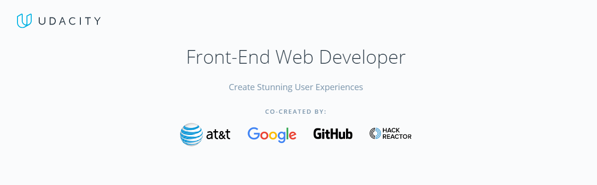

# Front-End-Web-Developer-Nanodegree-Program
A repository that contains all the projects I made in UDACITY Front-end Web Developer Nanodegree.


_________________________
**I loved the journey with the [Udacity Scholarship](https://www.udacity.com/scholarships). This repository contains all the projects that I made to complete the [Front-End Web Developer Nanodegree](https://www.udacity.com/course/nd001) from February 2018.**


## Repo

##### Inside the repo you'll find the following folders used to organize projects of FEND.

```
Front-End-Web-Developer-Nanodegree/
                                +--  Project-1 Animal Trading Cards/

```

## Projects (Links to Project Code)

##### The following is a list of projects required to complete the Front End Nanodegree.

##### 1. [Animal Trading Cards]()


## Links to Live Project Demo
____________________________________________________________________________________________

### 1. [Animal Trading Cards]()
